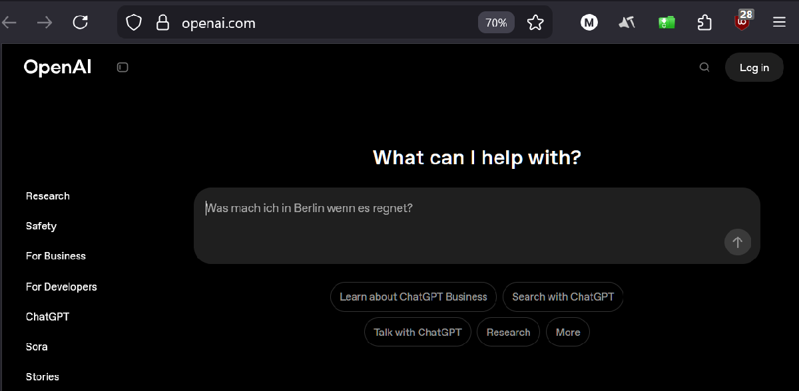
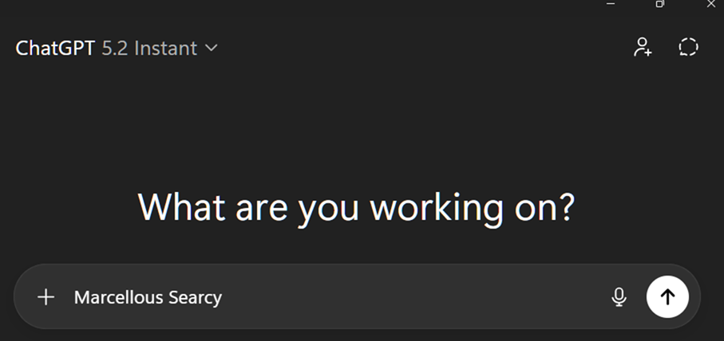

# Week 2 – Meet ChatGPT

## Overview
This week focuses on setting up and becoming familiar with ChatGPT as a core AI productivity and experimentation tool. The objective is to demonstrate correct account setup, interface familiarity, and basic prompt readiness.

## Objectives
- Create and verify a ChatGPT account
- Understand the ChatGPT interface
- Demonstrate readiness to interact with an AI assistant
- Provide visual proof of setup completion

## Screenshots

### ChatGPT Interface Loaded

### User Name Entered (Submission Requirement)
> Name typed into the chat box without submitting the message.

## Notes
- Message input was intentionally **not submitted**, per assignment instructions.
- Screenshots are included for verification and recruiter review.

